# AI-First 研发流程设计 - 实施指南

> 基于 developflow.png 传统开发流程的AI辅助变革方案

## 背景

**目标团队：** 中型后端研发团队（10-50人）
**当前工具：** Claude Code + Cursor
**核心痛点：** 代码质量不一致、交付速度慢、知识沉淀差、测试覆盖不足
**流程定位：** 全新设计AI-First流程

---

## 一、传统流程 vs AI-First流程对比

### 传统开发流程（基于 developflow.png）

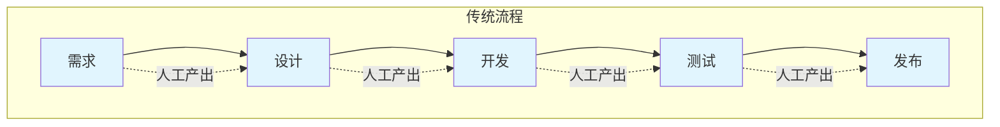

**输出件清单：**
| 阶段 | 输出件 |
|------|--------|
| 需求 | PRD/需求规格说明书 |
| 设计 | 架构设计文档、接口定义、技术方案 |
| 开发 | 源代码、单元测试用例 |
| 测试 | 测试报告、缺陷清单 |
| 发布 | 部署包、监控告警、运维手册 |

---

### AI-First 研发新流程

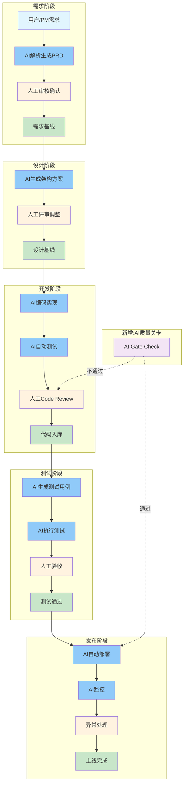

**图例说明：**
- 蓝色节点：AI主导环节（80%产出）
- 橙色节点：人工审核环节（20%决策）
- 绿色节点：基线/交付物
- 紫色节点：新增质量关卡

---

## 二、各阶段详细流程

### 阶段一：需求阶段

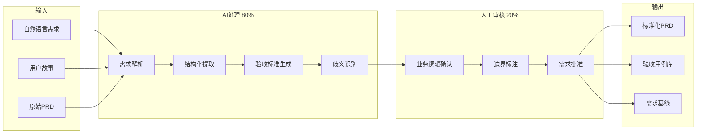

**输入输出控制：**

| 类型 | 内容 |
|------|------|
| 输入 | 自然语言需求、用户故事、原始PRD |
| AI输出 | 标准化PRD文档（格式统一、边界清晰、验收标准完整） |
| 人工输出 | 需求审核意见、修正说明 |
| 最终输出 | 需求基线PRD（带版本号） |

**AI/人分工：**
| 角色 | 职责 |
|------|------|
| AI (80%) | 解析模糊需求→结构化PRD、提取验收标准、生成验收用例、识别潜在歧义 |
| 人工 (20%) | 审核业务逻辑正确性、确认验收标准、批准需求基线 |

**关键控制点：**
- ✅ 需求验收标准必须人工确认
- ✅ 业务边界必须人工标注
- ✅ 需求变更必须触发AI重新生成

---

### 阶段二：设计阶段

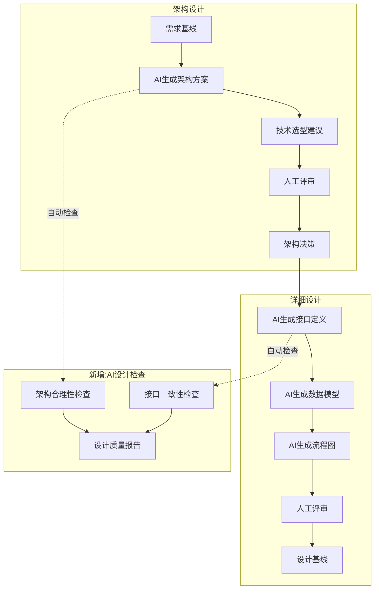

**设计阶段AI/人分工：**

| 环节 | AI职责 | 人工职责 |
|------|--------|----------|
| 架构方案生成 | 生成多套架构选型、对比分析 | 评审业务适配性、做最终决策 |
| 接口定义 | 生成OpenAPI/Proto定义 | 确认业务语义正确性 |
| 数据模型 | 生成ER图、DDL脚本 | 确认业务边界和约束 |
| 流程图 | 生成时序图、泳道图 | 确认业务流程正确性 |

---

### 阶段三：开发阶段

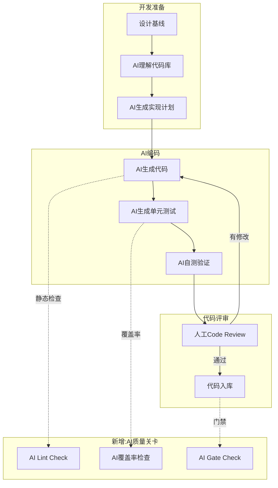

**AI编码规范：**

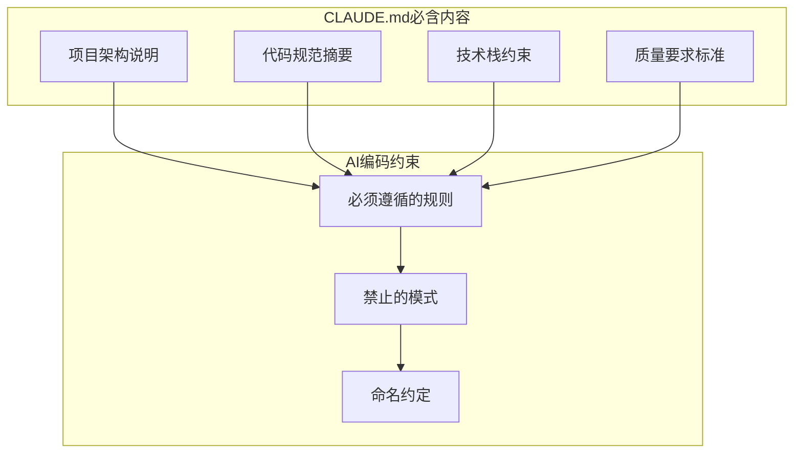

**关键配置：** 项目根目录必须有 `CLAUDE.md` 文件，包含项目架构、代码规范、技术约束。

---

### 阶段四：测试阶段

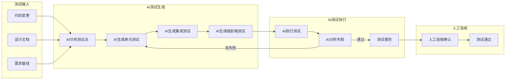

**测试覆盖增强：**

| 测试类型 | AI能力 | 人工职责 |
|----------|--------|----------|
| 单元测试 | 自动生成，覆盖率>80% | 审核边界用例 |
| 集成测试 | 自动生成接口测试 | 确认业务场景 |
| 端到端测试 | 自动生成用户旅程 | 验收用户体验 |
| 回归测试 | 智能选择回归范围 | 确认关键路径 |

---

### 阶段五：发布阶段

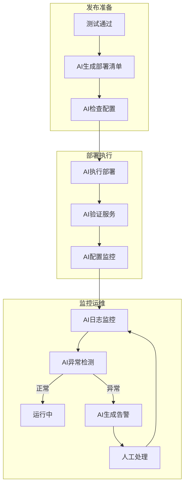

---

## 三、新增核心机制

### 1. AI上下文管理（CLAUDE.md体系）

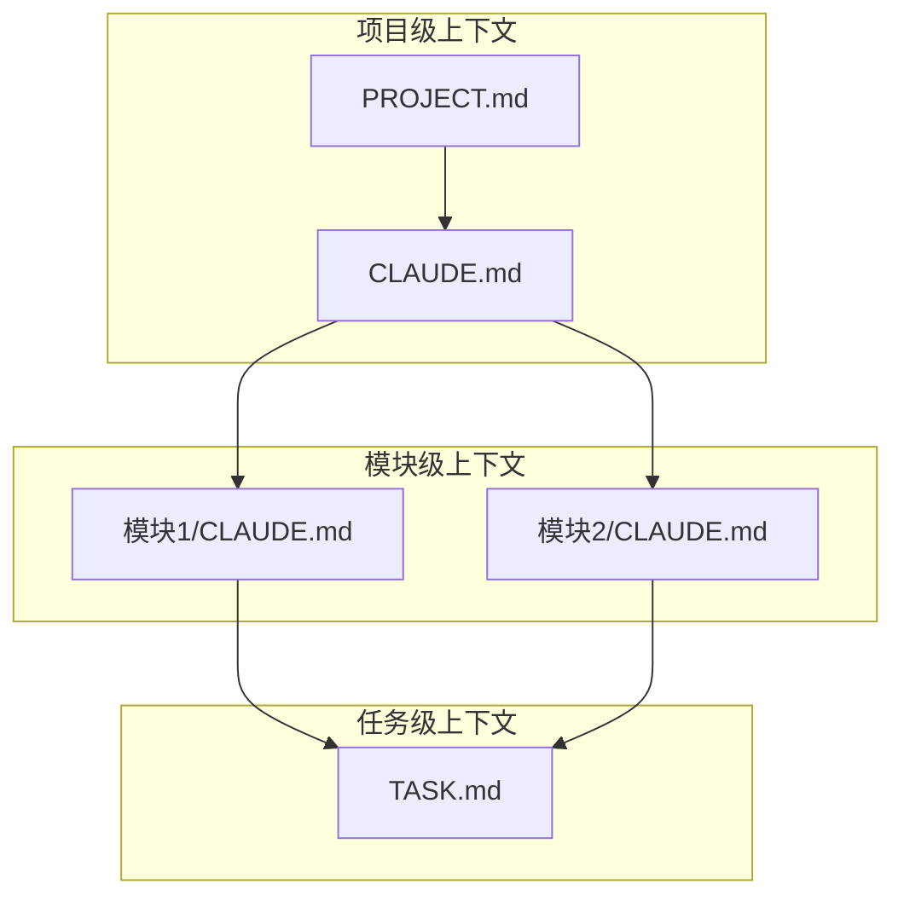

| 文件 | 作用 | 维护者 |
|------|------|--------|
| `CLAUDE.md` | 项目级AI上下文，包含架构、规范、约束 | 团队维护 |
| `模块/CLAUDE.md` | 模块级AI上下文 | 模块owner |
| `TASK.md` | 任务级AI上下文 | 任务执行时生成 |

**CLAUDE.md模板：**

```markdown
# 项目CLAUDE.md

## 项目概述
- 项目名称、目标、范围
- 核心业务逻辑说明

## 技术架构
- 技术栈及选型理由
- 架构设计图
- 模块划分说明

## 代码规范
- 命名约定
- 目录结构约定
- 注释规范

## 质量要求
- 测试覆盖率要求 (>80%)
- 代码评审要求
- 提交信息规范

## 禁止事项
- ❌ 不允许的模式
- ❌ 安全敏感操作
```

---

### 2. AI质量关卡（AI Gate Check）

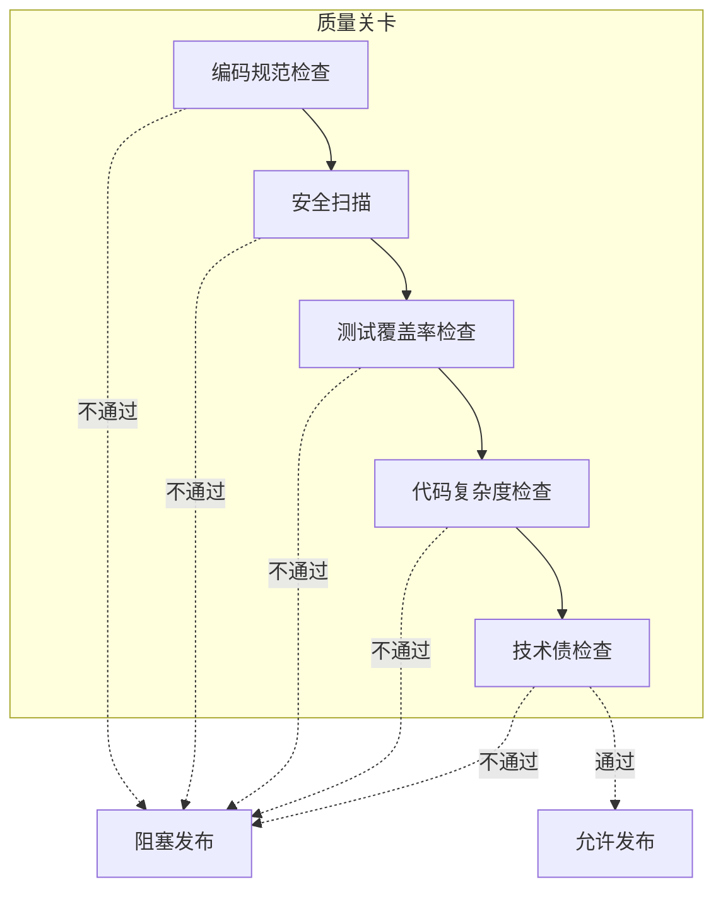

**质量关卡检查项：**

| 检查项 | 阈值 | 处理方式 |
|--------|------|----------|
| 代码规范 | 100%通过 | 阻塞 |
| 安全扫描 | 0高危漏洞 | 阻塞 |
| 覆盖率 | >80% | 警告/阻塞 |
| 复杂度 | Cyclomatic<15 | 警告 |
| 技术债 | <5%新增 | 警告 |

---

### 3. 能力沉淀机制

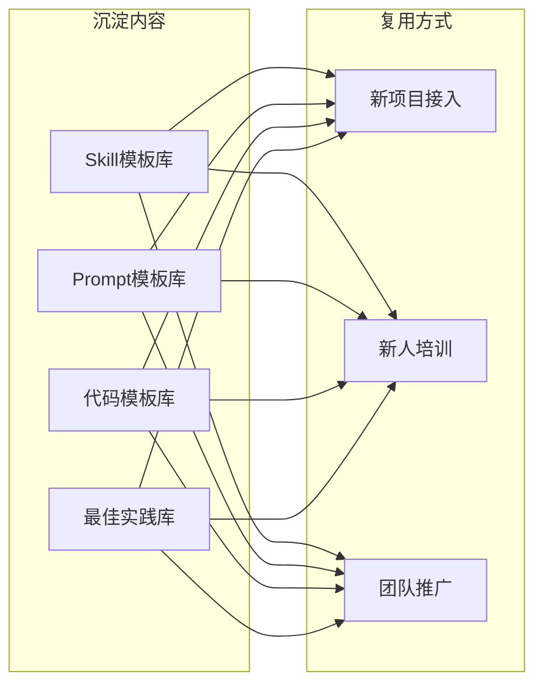

**推荐沉淀的Skills：**

| Skill名称 | 触发场景 | 内容要点 |
|-----------|----------|----------|
| `code-review` | 代码提交后 | 团队代码规范、常见问题检查清单 |
| `test-generation` | 开发完成后 | 测试策略、覆盖率要求、用例模板 |
| `api-design` | 接口设计时 | RESTful规范、命名约定、版本管理 |
| `db-migration` | 数据库变更时 | 变更规范、回滚策略 |
| `deploy-check` | 发布前检查 | 发布清单、回滚预案 |
| `incident-response` | 故障处理时 | 故障分级、响应流程 |

---

## 四、AI/人职责划分

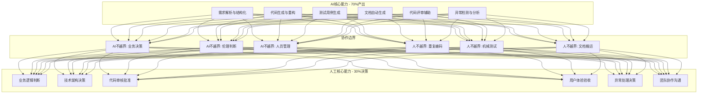

**职责边界定义：**

| AI可以做 | AI不可做 |
|----------|----------|
| 解析需求生成PRD | 决定需求优先级 |
| 生成架构方案 | 选择最终架构 |
| 编写代码实现 | 批准代码入库 |
| 生成测试用例 | 验收用户体验 |
| 执行自动化部署 | 处理生产故障 |
| 分析监控数据 | 决定告警策略 |

---

## 五、关键人工角色定义

### 角色全景图

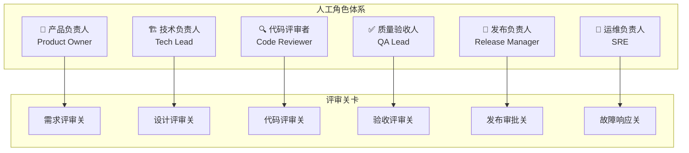

### 角色与评审关卡映射

```mermaid
flowchart LR
    subgraph 需求阶段
        R_AI[AI生成PRD] --> R1[产品负责人审核]
        R1 --> R2[技术负责人可行性评估]
    end
    
    subgraph 设计阶段
        D_AI[AI生成架构方案] --> D1[技术负责人评审]
        D1 --> D2[技术负责人批准]
    end
    
    subgraph 开发阶段
        C_AI[AI编码+自测] --> C1[代码评审者Review]
        C1 --> C2[技术负责人批准入库]
    end
    
    subgraph 测试阶段
        T_AI[AI生成+执行测试] --> T1[质量验收人确认]
        T1 --> T2[产品负责人验收]
    end
    
    subgraph 发布阶段
        P_AI[AI部署+监控] --> P1[发布负责人审批]
        P1 --> P2[运维负责人监控]
        P2 --> P3[故障: 运维负责人决策]
    end
    
    R2 --> D_AI
    D2 --> C_AI
    C2 --> T_AI
    T2 --> P_AI
    
    style R1 fill:#fff3e0
    style R2 fill:#fff3e0
    style D1 fill:#fff3e0
    style D2 fill:#fff3e0
    style C1 fill:#fff3e0
    style C2 fill:#fff3e0
    style T1 fill:#fff3e0
    style T2 fill:#fff3e0
    style P1 fill:#fff3e0
    style P2 fill:#fff3e0
    style P3 fill:#fff3e0
```

### 角色一：产品负责人 (Product Owner)

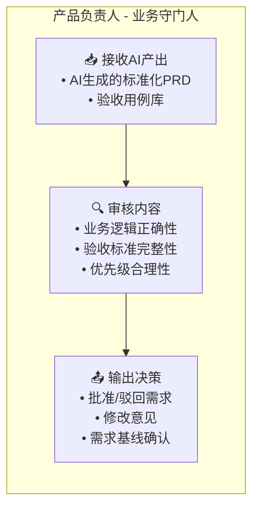

**核心职责：**

| 职责 | 说明 | 审核要点 |
|------|------|----------|
| 需求审核 | 审核AI生成的PRD | 业务逻辑是否正确、边界是否清晰 |
| 验收标准确认 | 确认AI生成的验收用例 | 是否覆盖核心业务场景 |
| 需求基线批准 | 批准需求进入设计阶段 | 需求是否无歧义、可度量 |
| 阶段四验收 | 测试通过后的最终验收 | 产品体验是否达标 |

**审核检查清单：**
```markdown
## 产品负责人审核清单
- [ ] AI生成的PRD是否完整覆盖原始需求
- [ ] 验收标准是否可测试、可度量
- [ ] 业务边界和异常场景是否标注
- [ ] 需求优先级是否合理
- [ ] 与已有功能是否存在冲突
- [ ] 验收体验是否达到预期
```

---

### 角色二：技术负责人 (Tech Lead)

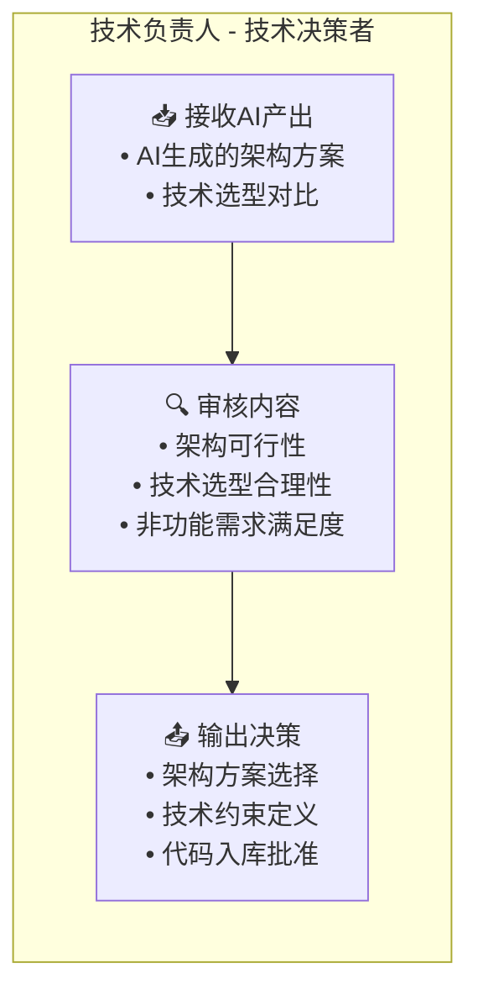

**核心职责：**

| 职责 | 说明 | 审核要点 |
|------|------|----------|
| 架构评审 | 评审AI生成的架构方案 | 是否满足业务场景、性能、扩展性 |
| 技术选型 | 从AI建议中做最终决策 | 技术栈匹配度、团队能力匹配 |
| 设计基线批准 | 批准设计进入开发阶段 | 接口定义完整性、数据模型合理性 |
| 代码入库批准 | 批准代码合并到主分支 | 整体架构一致性、技术债控制 |
| 需求可行性评估 | 评估需求技术可行性 | 技术风险、工期合理性 |

**审核检查清单：**
```markdown
## 技术负责人审核清单
- [ ] 架构方案是否满足非功能需求（性能、安全、扩展性）
- [ ] 技术选型是否与团队技术栈一致
- [ ] 接口定义是否完整、无歧义
- [ ] 数据模型是否覆盖所有业务场景
- [ ] 设计方案是否考虑了可测试性
- [ ] 代码合并是否影响整体架构
```

---

### 角色三：代码评审者 (Code Reviewer)

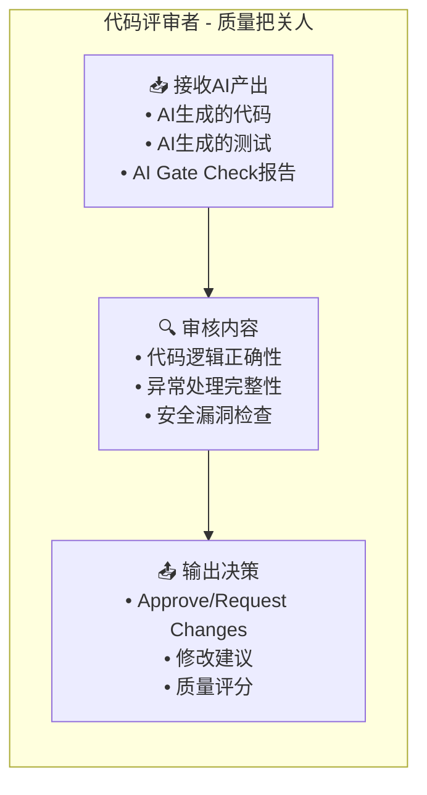

**核心职责：**

| 职责 | 说明 | 审核要点 |
|------|------|----------|
| 代码逻辑审核 | 审核AI生成的代码 | 逻辑是否正确、边界是否处理 |
| 异常处理检查 | 检查异常和错误处理 | 是否覆盖所有异常路径 |
| 安全审查 | 检查安全漏洞 | SQL注入、XSS、敏感数据处理 |
| 代码规范检查 | 检查代码风格 | 命名规范、注释完整性 |
| 测试覆盖审核 | 审核AI生成的测试 | 关键路径是否覆盖、断言是否有效 |

**审核检查清单：**
```markdown
## 代码评审者审核清单
- [ ] 代码逻辑是否正确实现设计意图
- [ ] 边界条件和异常场景是否处理
- [ ] 是否存在安全漏洞（OWASP Top 10）
- [ ] 命名是否规范、可读性好
- [ ] 关键逻辑是否有注释说明
- [ ] 单元测试是否覆盖关键路径
- [ ] 测试断言是否有效（不是恒真）
- [ ] 是否引入不必要的依赖
```

---

### 角色四：质量验收人 (QA Lead)

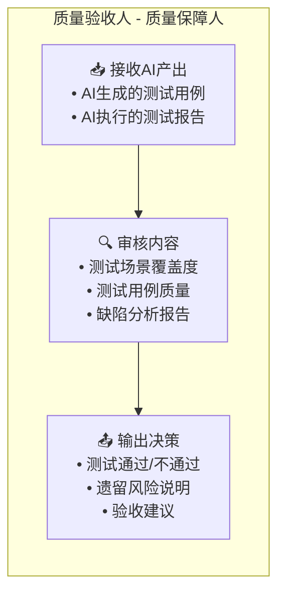

**核心职责：**

| 职责 | 说明 | 审核要点 |
|------|------|----------|
| 测试用例审核 | 审核AI生成的测试用例 | 场景覆盖是否完整、边界是否充分 |
| 测试报告评审 | 评审AI的测试执行结果 | 失败原因分析、风险评估 |
| 质量关卡判定 | 判定是否通过质量关卡 | 覆盖率、缺陷率是否达标 |
| 验收建议 | 给出验收建议 | 遗留风险是否可接受 |

**审核检查清单：**
```markdown
## 质量验收人审核清单
- [ ] 测试用例是否覆盖所有需求场景
- [ ] 边界值和异常场景是否有测试
- [ ] 测试覆盖率是否达到80%阈值
- [ ] 所有P0/P1缺陷是否已修复
- [ ] 遗留缺陷是否有规避方案
- [ ] 性能测试是否达标
```

---

### 角色五：发布负责人 (Release Manager)

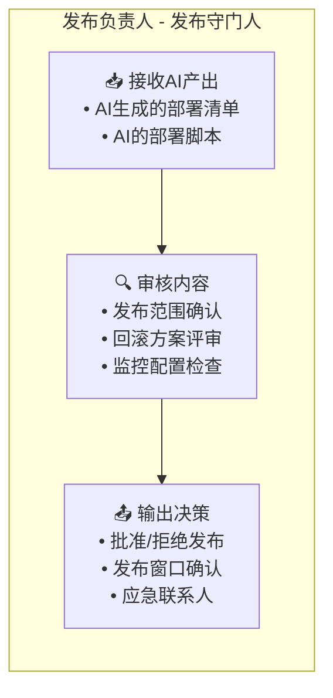

**核心职责：**

| 职责 | 说明 | 审核要点 |
|------|------|----------|
| 发布审批 | 审批是否可以发布 | 测试是否通过、风险是否可控 |
| 发布范围确认 | 确认发布内容 | 变更范围、影响分析 |
| 回滚方案评审 | 评审AI生成的回滚方案 | 回滚是否完整、是否可执行 |
| 发布窗口管理 | 确定发布时间 | 是否避开业务高峰 |

**审核检查清单：**
```markdown
## 发布负责人审核清单
- [ ] 测试报告是否全部通过
- [ ] 发布范围是否明确、无遗漏
- [ ] 回滚方案是否可执行
- [ ] 监控告警是否配置完成
- [ ] 应急响应人是否到位
- [ ] 发布窗口是否合适
```

---

### 角色六：运维负责人 (SRE)

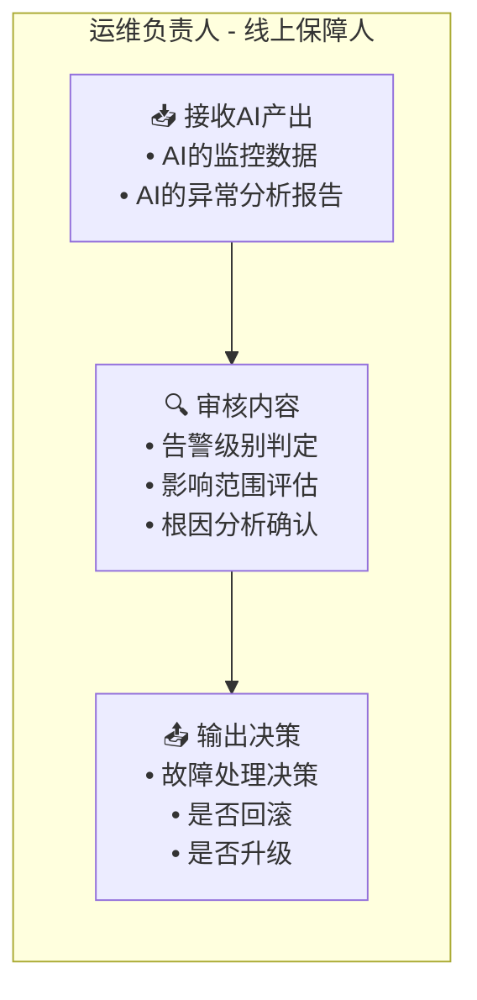

**核心职责：**

| 职责 | 说明 | 审核要点 |
|------|------|----------|
| 监控审核 | 审核AI的监控分析 | 异常是否准确识别 |
| 故障响应决策 | 做故障处理决策 | 影响范围、处理方案 |
| 回滚决策 | 决定是否回滚 | 故障严重度、修复时间 |
| 根因确认 | 确认AI的根因分析 | 分析是否正确、彻底 |

**审核检查清单：**
```markdown
## 运维负责人审核清单
- [ ] AI异常检测是否准确（误报率）
- [ ] 故障影响范围是否评估完整
- [ ] 处理方案是否合理
- [ ] 是否需要回滚
- [ ] 根因分析是否彻底
- [ ] 是否需要升级处理
```

---

### 角色与流程阶段映射总表

```mermaid
graph LR
    subgraph 流程阶段
        R[需求] --> D[设计] --> C[开发] --> T[测试] --> P[发布] --> O[运维]
    end
    
    subgraph 人工角色
        PO[产品负责人]
        TL[技术负责人]
        CR[代码评审者]
        QA[质量验收人]
        RM[发布负责人]
        SRE[运维负责人]
    end
    
    R -.->|"需求审核<br/>可行性评估"| PO
    R -.->|"可行性评估"| TL
    D -.->|"架构评审<br/>设计批准"| TL
    C -.->|"Code Review"| CR
    C -.->|"入库批准"| TL
    T -.->|"质量验收"| QA
    T -.->|"产品验收"| PO
    P -.->|"发布审批"| RM
    O -.->|"故障响应"| SRE
```

**角色参与矩阵（R=负责 A=审核 I=知会）：**

| 流程环节 | 产品负责人 | 技术负责人 | 代码评审者 | 质量验收人 | 发布负责人 | 运维负责人 |
|----------|-----------|-----------|-----------|-----------|-----------|-----------|
| 需求审核 | **R** | A | - | I | - | - |
| 设计评审 | I | **R** | - | I | - | - |
| Code Review | - | A | **R** | - | - | - |
| 测试验收 | A | I | - | **R** | - | - |
| 发布审批 | I | I | - | I | **R** | - |
| 线上运维 | - | I | - | - | I | **R** |

---

### 角色配置建议（按团队规模）

**10-20人团队：**
```mermaid
graph TB
    subgraph 角色合并方案
        PO["产品负责人<br/>(PM兼任)"]
        TL_CR["技术负责人<br/>(兼代码评审)"]
        QA_RM["质量验收人<br/>(兼发布审批)"]
        SRE["运维负责人"]
    end
    
    PO --> TL_CR --> QA_RM --> SRE
```

**20-50人团队：**
```mermaid
graph TB
    subgraph 角色独立方案
        PO["产品负责人 x1"]
        TL["技术负责人 x1-2"]
        CR["代码评审者 x3-5<br/>(资深开发兼任)"]
        QA["质量验收人 x1-2"]
        RM["发布负责人 x1<br/>(QA兼任)"]
        SRE["运维负责人 x1-2"]
    end
    
    PO --> TL --> CR --> QA --> RM --> SRE
```

---

## 六、团队推广方案

```mermaid
flowchart LR
    subgraph 第一阶段[阶段一:试点验证 2周]
        P1[选择1个试点项目]
        P2[配置CLAUDE.md]
        P3[沉淀核心Skills]
        P4[验证流程可行性]
    end
    
    subgraph 第二阶段[阶段二:小范围推广 4周]
        S1[扩展到3个项目]
        S2[完善能力沉淀]
        S3[培训3-5名种子用户]
        S4[收集反馈迭代]
    end
    
    subgraph 第三阶段[阶段三:全员推广 8周]
        F1[覆盖所有项目]
        F2[建立能力中台]
        F3[全员培训]
        F4[持续优化机制]
    end
    
    P1 --> P2 --> P3 --> P4
    P4 --> S1 --> S2 --> S3 --> S4
    S4 --> F1 --> F2 --> F3 --> F4
```

**推广里程碑：**

| 阶段 | 时间 | 目标 | 验收标准 |
|------|------|------|----------|
| 试点验证 | 第1-2周 | 验证流程可行性 | 完成需求到发布全流程 |
| 小范围推广 | 第3-6周 | 完善能力沉淀 | 研发效率提升20% |
| 全员推广 | 第7-14周 | 团队全面覆盖 | 研发效率提升50% |

---

## 七、效果评估指标

| 指标类型 | 指标名称 | 基准值 | 目标值 |
|----------|----------|--------|--------|
| 效率 | 需求到交付周期 | 14天 | 7天 |
| 效率 | 代码编写效率 | 基准 | +100% |
| 质量 | 代码缺陷率 | 5% | 3% |
| 质量 | 测试覆盖率 | 60% | 80% |
| 质量 | 线上故障率 | 基准 | -50% |
| 能力 | Skills复用率 | 0% | 70% |
| 能力 | 新人上手时间 | 30天 | 15天 |

---

## 八、实施前置条件清单

- [ ] Claude Code 已安装并配置
- [ ] Cursor 已安装（可选）
- [ ] 代码仓库已准备
- [ ] CLAUDE.md规范已制定
- [ ] 试点项目已选定
- [ ] 种子用户已确定

---

## 九、下一步行动

1. **确认方案** - 与团队确认此AI-First流程设计
2. **准备环境** - 配置Claude Code、创建CLAUDE.md
3. **试点启动** - 选择试点项目开始验证
4. **持续迭代** - 根据实践反馈优化流程

---

*文档版本: v1.1*
*创建日期: 2026-04-14*
*更新日期: 2026-04-14 - 新增关键人工角色定义*
*基于: developflow.png 传统开发流程*