# AI-First 研发流程设计 - 实施指南

> 基于 developflow.png 传统开发流程的AI辅助变革方案

## 背景

**目标团队：** 中型后端研发团队（10-50人）
**当前工具：** Claude Code + Cursor
**核心痛点：** 代码质量不一致、交付速度慢、知识沉淀差、测试覆盖不足
**流程定位：** 全新设计AI-First流程

---

## 一、传统流程 vs AI-First流程对比

### 传统开发流程（基于 developflow.png）

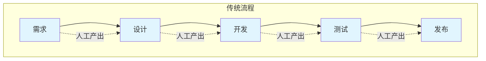

**输出件清单：**
| 阶段 | 输出件 |
|------|--------|
| 需求 | PRD/需求规格说明书 |
| 设计 | 架构设计文档、接口定义、技术方案 |
| 开发 | 源代码、单元测试用例 |
| 测试 | 测试报告、缺陷清单 |
| 发布 | 部署包、监控告警、运维手册 |

---

### AI-First 研发新流程

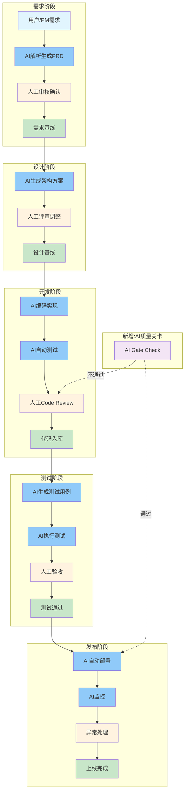

**图例说明：**
- 蓝色节点：AI主导环节（80%产出）
- 橙色节点：人工审核环节（20%决策）
- 绿色节点：基线/交付物
- 紫色节点：新增质量关卡

---

## 二、各阶段详细流程

### 阶段一：需求阶段

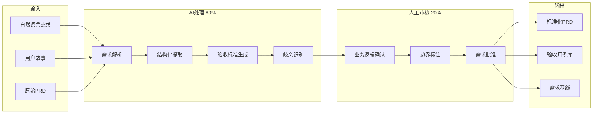

**输入输出控制：**

| 类型 | 内容 |
|------|------|
| 输入 | 自然语言需求、用户故事、原始PRD |
| AI输出 | 标准化PRD文档（格式统一、边界清晰、验收标准完整） |
| 人工输出 | 需求审核意见、修正说明 |
| 最终输出 | 需求基线PRD（带版本号） |

**AI/人分工：**
| 角色 | 职责 |
|------|------|
| AI (80%) | 解析模糊需求→结构化PRD、提取验收标准、生成验收用例、识别潜在歧义 |
| 人工 (20%) | 审核业务逻辑正确性、确认验收标准、批准需求基线 |

**关键控制点：**
- ✅ 需求验收标准必须人工确认
- ✅ 业务边界必须人工标注
- ✅ 需求变更必须触发AI重新生成

---

### 阶段二：设计阶段

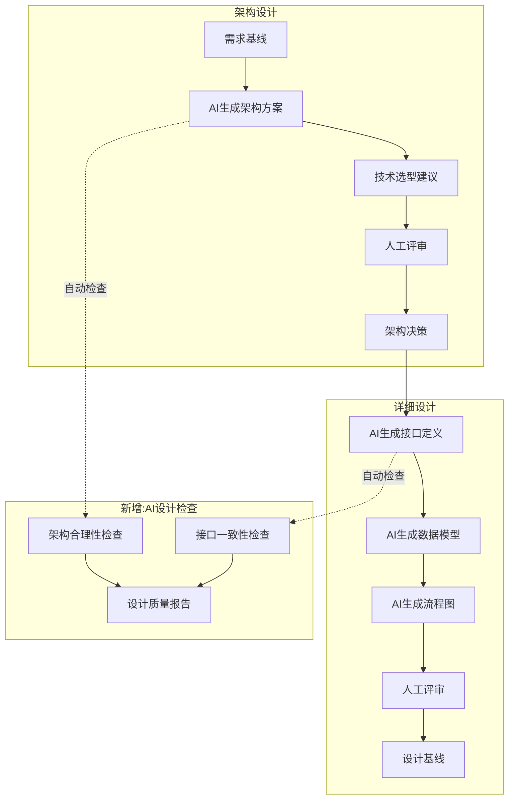

**设计阶段AI/人分工：**

| 环节 | AI职责 | 人工职责 |
|------|--------|----------|
| 架构方案生成 | 生成多套架构选型、对比分析 | 评审业务适配性、做最终决策 |
| 接口定义 | 生成OpenAPI/Proto定义 | 确认业务语义正确性 |
| 数据模型 | 生成ER图、DDL脚本 | 确认业务边界和约束 |
| 流程图 | 生成时序图、泳道图 | 确认业务流程正确性 |

---

### 阶段三：开发阶段

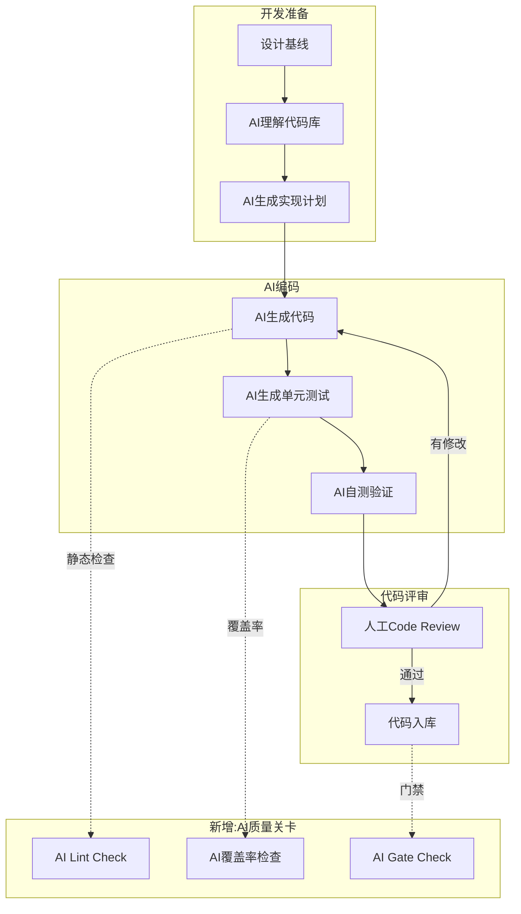

**AI编码规范：**

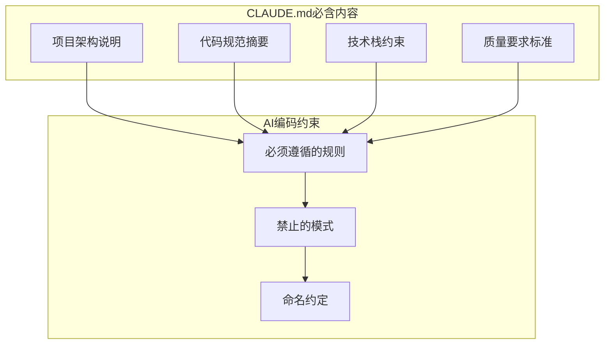

**关键配置：** 项目根目录必须有 `CLAUDE.md` 文件，包含项目架构、代码规范、技术约束。

---

### 阶段四：测试阶段

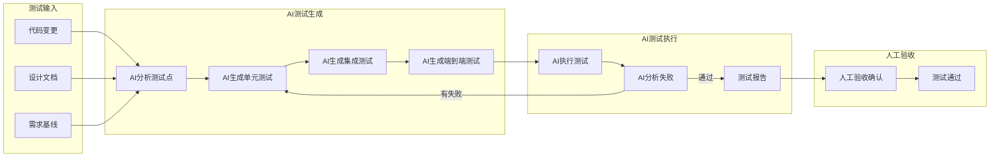

**测试覆盖增强：**

| 测试类型 | AI能力 | 人工职责 |
|----------|--------|----------|
| 单元测试 | 自动生成，覆盖率>80% | 审核边界用例 |
| 集成测试 | 自动生成接口测试 | 确认业务场景 |
| 端到端测试 | 自动生成用户旅程 | 验收用户体验 |
| 回归测试 | 智能选择回归范围 | 确认关键路径 |

---

### 阶段五：发布阶段

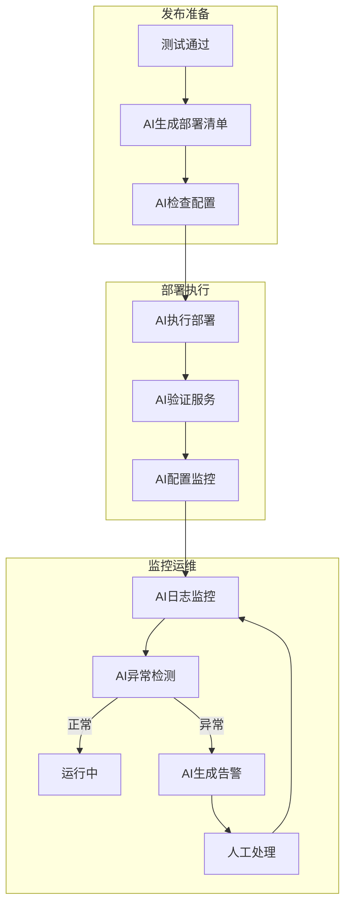

---

## 三、新增核心机制

### 1. AI上下文管理（CLAUDE.md体系）

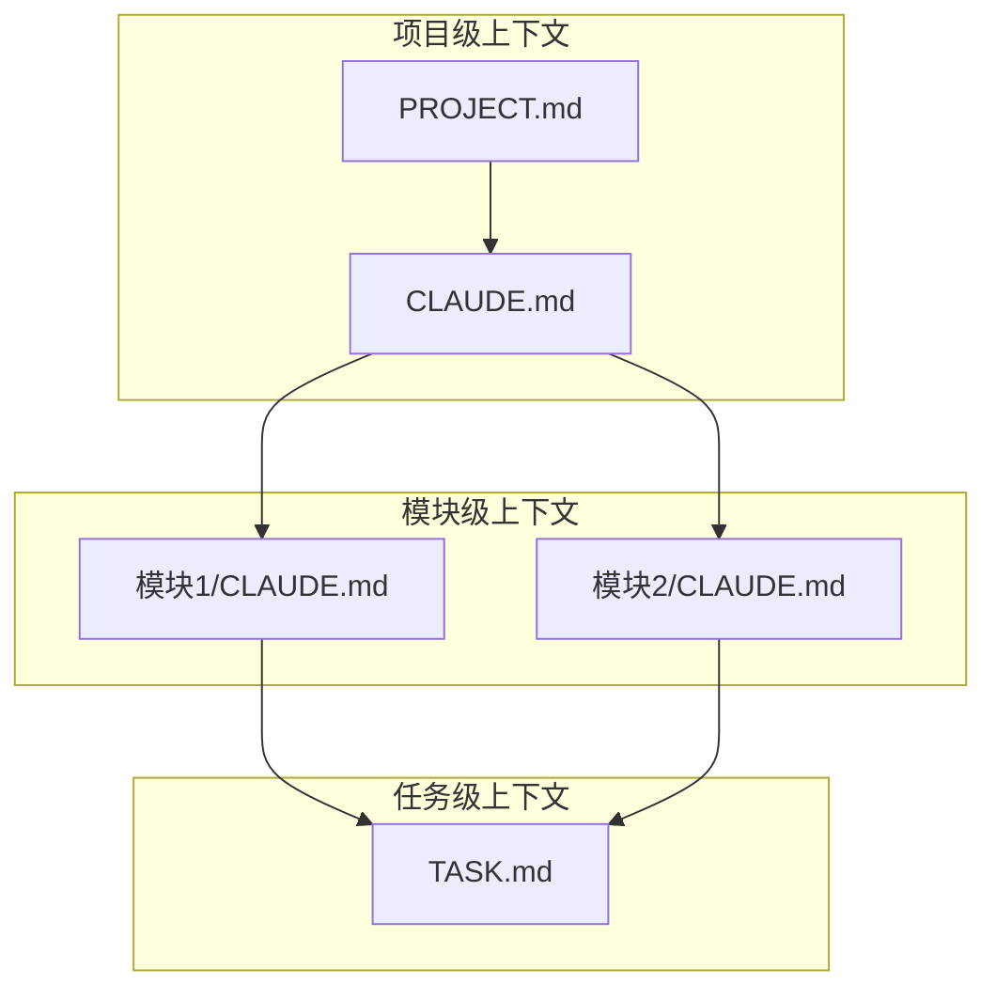

| 文件 | 作用 | 维护者 |
|------|------|--------|
| `CLAUDE.md` | 项目级AI上下文，包含架构、规范、约束 | 团队维护 |
| `模块/CLAUDE.md` | 模块级AI上下文 | 模块owner |
| `TASK.md` | 任务级AI上下文 | 任务执行时生成 |

**CLAUDE.md模板：**

```markdown
# 项目CLAUDE.md

## 项目概述
- 项目名称、目标、范围
- 核心业务逻辑说明

## 技术架构
- 技术栈及选型理由
- 架构设计图
- 模块划分说明

## 代码规范
- 命名约定
- 目录结构约定
- 注释规范

## 质量要求
- 测试覆盖率要求 (>80%)
- 代码评审要求
- 提交信息规范

## 禁止事项
- ❌ 不允许的模式
- ❌ 安全敏感操作
```

---

### 2. AI质量关卡（AI Gate Check）

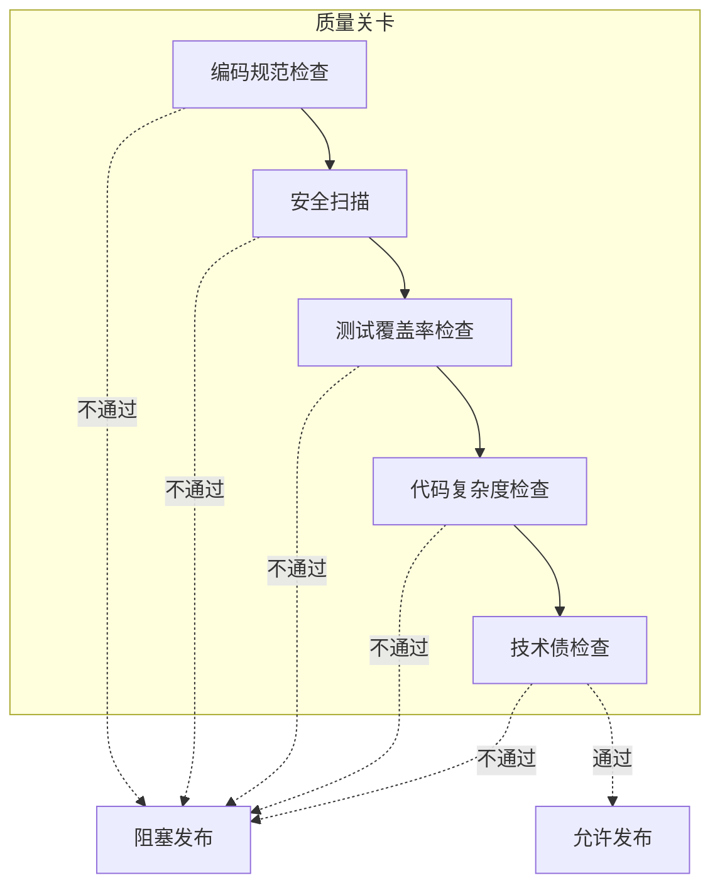

**质量关卡检查项：**

| 检查项 | 阈值 | 处理方式 |
|--------|------|----------|
| 代码规范 | 100%通过 | 阻塞 |
| 安全扫描 | 0高危漏洞 | 阻塞 |
| 覆盖率 | >80% | 警告/阻塞 |
| 复杂度 | Cyclomatic<15 | 警告 |
| 技术债 | <5%新增 | 警告 |

---

### 3. 能力沉淀机制

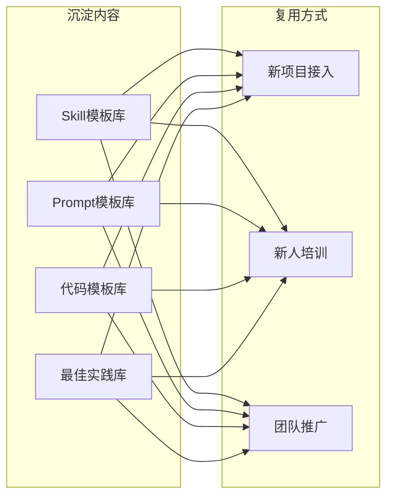

**推荐沉淀的Skills：**

| Skill名称 | 触发场景 | 内容要点 |
|-----------|----------|----------|
| `code-review` | 代码提交后 | 团队代码规范、常见问题检查清单 |
| `test-generation` | 开发完成后 | 测试策略、覆盖率要求、用例模板 |
| `api-design` | 接口设计时 | RESTful规范、命名约定、版本管理 |
| `db-migration` | 数据库变更时 | 变更规范、回滚策略 |
| `deploy-check` | 发布前检查 | 发布清单、回滚预案 |
| `incident-response` | 故障处理时 | 故障分级、响应流程 |

---

## 四、AI/人职责划分

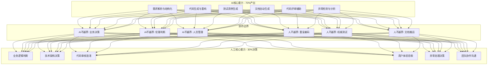

**职责边界定义：**

| AI可以做 | AI不可做 |
|----------|----------|
| 解析需求生成PRD | 决定需求优先级 |
| 生成架构方案 | 选择最终架构 |
| 编写代码实现 | 批准代码入库 |
| 生成测试用例 | 验收用户体验 |
| 执行自动化部署 | 处理生产故障 |
| 分析监控数据 | 决定告警策略 |

---

## 五、团队推广方案

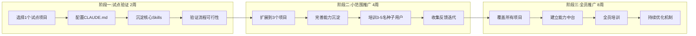

**推广里程碑：**

| 阶段 | 时间 | 目标 | 验收标准 |
|------|------|------|----------|
| 试点验证 | 第1-2周 | 验证流程可行性 | 完成需求到发布全流程 |
| 小范围推广 | 第3-6周 | 完善能力沉淀 | 研发效率提升20% |
| 全员推广 | 第7-14周 | 团队全面覆盖 | 研发效率提升50% |

---

## 六、效果评估指标

| 指标类型 | 指标名称 | 基准值 | 目标值 |
|----------|----------|--------|--------|
| 效率 | 需求到交付周期 | 14天 | 7天 |
| 效率 | 代码编写效率 | 基准 | +100% |
| 质量 | 代码缺陷率 | 5% | 3% |
| 质量 | 测试覆盖率 | 60% | 80% |
| 质量 | 线上故障率 | 基准 | -50% |
| 能力 | Skills复用率 | 0% | 70% |
| 能力 | 新人上手时间 | 30天 | 15天 |

---

## 七、实施前置条件清单

- [ ] Claude Code 已安装并配置
- [ ] Cursor 已安装（可选）
- [ ] 代码仓库已准备
- [ ] CLAUDE.md规范已制定
- [ ] 试点项目已选定
- [ ] 种子用户已确定

---

## 八、下一步行动

1. **确认方案** - 与团队确认此AI-First流程设计
2. **准备环境** - 配置Claude Code、创建CLAUDE.md
3. **试点启动** - 选择试点项目开始验证
4. **持续迭代** - 根据实践反馈优化流程

---

*文档版本: v1.0*
*创建日期: 2026-04-14*
*基于: developflow.png 传统开发流程*